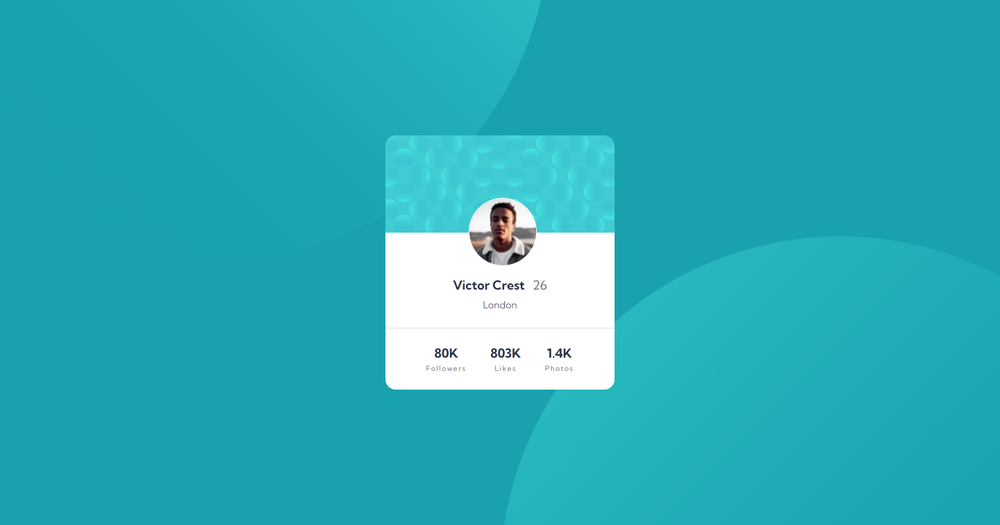

# Frontend Mentor - Profile card component solution

This is a solution to the [Profile card component challenge on Frontend Mentor](https://www.frontendmentor.io/challenges/profile-card-component-cfArpWshJ). Frontend Mentor challenges help you improve your coding skills by building realistic projects.

## Table of contents

-   [Overview](#overview)
    -   [The challenge](#the-challenge)
    -   [Screenshot](#screenshot)
    -   [Links](#links)
-   [My process](#my-process)
    -   [Built with](#built-with)
    -   [What I learned](#what-i-learned)
-   [Author](#author)

## Overview

### The challenge

-   Build out the project to the designs provided

### Screenshot



### Links

-   Solution URL: [https://github.com/ChinatuL/Profile-Card-Component](https://github.com/ChinatuL/Profile-Card-Component)
-   Live Site URL: [https://chinatul.github.io/Profile-Card-Component/](https://chinatul.github.io/Profile-Card-Component/)

## My process

### Built with

-   Semantic HTML5 markup
-   CSS custom properties
-   Flexbox
-   Mobile-first workflow

### What I learned

I learned how to add two background images and style appropriately with the CSS background position property.

```css
.body {
    background: url(./images/bg-pattern-top.svg),
        url(./images/bg-pattern-bottom.svg);
    background-color: var(--dark-cyan);
    background-repeat: no-repeat, no-repeat;
    background-position: right 45vw bottom 50vh, left 50vw top 45vh;
}
```

## Author

-   Frontend Mentor - [ChinatuL](https://www.frontendmentor.io/profile/ChinatuL)
-   Twitter - [Chinatu Lucia](https://www.twitter.com/ChinatuLucia)
